# Hệ thống Xác thực và Kiểm soát Truy cập Mạng Không dây
## Wireless Access Control & Authentication System với 802.1X + RADIUS


---

## 📋 Tổng quan Dự án

Đây là dự án đồ án môn học **An toàn Mạng Không dây và Di động** được triển khai thực tế nhằm xây dựng một hệ thống mạng WiFi doanh nghiệp an toàn, sử dụng **xác thực từng người dùng** (per-user authentication) thay vì mật khẩu chung, đáp ứng các tiêu chuẩn bảo mật quốc tế và yêu cầu kiểm toán.

### 🎯 Vấn đề giải quyết

**Thực trạng:** Hầu hết mạng WiFi tại Việt Nam sử dụng WPA2-PSK (mật khẩu chung) dẫn đến:
- ❌ Không thể truy vết hành vi người dùng cụ thể
- ❌ Không thể thu hồi quyền truy cập khi nhân viên nghỉ việc
- ❌ Mật khẩu bị chia sẻ rộng rãi qua email, chat
- ❌ Không đáp ứng yêu cầu pháp lý về ghi log và kiểm toán
- ❌ Một khi mật khẩu lộ, toàn bộ mạng bị xâm nhập

**Giải pháp triển khai:**
- ✅ Xác thực chuẩn **IEEE 802.1X** với **RADIUS Server** tập trung
- ✅ Mỗi người dùng có tài khoản riêng, dễ dàng quản lý và thu hồi
- ✅ Phân đoạn mạng theo chức năng (Staff, Guest, Server) với **VLAN**
- ✅ Tường lửa **pfSense** kiểm soát truy cập giữa các vùng mạng
- ✅ Giám sát và ghi log toàn bộ hoạt động web với **Squid Proxy**
- ✅ Chi phí $0 (sử dụng mã nguồn mở: FreeRADIUS, pfSense)

### 🏆 Kết quả đạt được

| Tiêu chí | Kết quả thực tế | Minh chứng |
|---------|-----------------|------------|
| **Xác thực thành công** | 100% người dùng hợp lệ được cấp quyền | Access-Accept từ RADIUS |
| **Phân đoạn mạng** | Guest bị chặn 100% truy cập nội bộ | Request Timeout khi ping Server |
| **Giám sát traffic** | Bắt được URL, DNS query, search terms | Squid access.log |
| **Chặn mối đe dọa** | 15,247 IP độc hại bị chặn | pfBlockerNG logs |
| **Hỗ trợ thiết bị** | Windows, Linux, Android, iOS | Kiểm thử đa nền tảng |

---

## 🔧 Kỹ năng Kỹ thuật Đạt được

### Network Security Engineering
- ✅ Thiết kế và triển khai **IEEE 802.1X Port-Based Authentication**
- ✅ Cấu hình **RADIUS Server** (FreeRADIUS) cho xác thực tập trung
- ✅ Quản lý **PKI Certificate** cho EAP-TLS authentication
- ✅ Phân đoạn mạng với **VLAN** và ACL (Access Control List)
- ✅ Thiết kế chính sách **Zero-Trust Network Segmentation**

### Firewall & Network Administration
- ✅ Triển khai và hardening **pfSense Firewall** từ đầu
- ✅ Cấu hình **Firewall Rules** phức tạp đa vùng mạng (Staff/Guest/Server)
- ✅ NAT, routing, inter-VLAN communication
- ✅ DHCP Server, DNS Resolver cho nhiều subnet
- ✅ **Transparent Proxy** (Squid) với SSL MITM Inspection

### System Administration (Linux)
- ✅ Quản trị **Ubuntu Server** (FreeRADIUS, Apache)
- ✅ Cấu hình **Hostapd** (Software Access Point)
- ✅ Networking: Bridge mode, IP forwarding, iptables
- ✅ Service management: systemctl, logs analysis
- ✅ Certificate management: OpenSSL, CA hierarchy

### Security Monitoring & Threat Detection
- ✅ Tích hợp **Squid Proxy** cho logging HTTP/HTTPS traffic
- ✅ **SSL Inspection** với CA tự ký (Man-in-the-Middle analysis)
- ✅ Triển khai **pfBlockerNG** với threat intelligence feeds
- ✅ Log correlation: `/var/squid/logs/access.log`, RADIUS logs
- ✅ Traffic analysis và user behavior monitoring

### Network Infrastructure Design
- ✅ Thiết kế topology mạng doanh nghiệp trên **GNS3**
- ✅ Sơ đồ mạng logic với Cisco Packet Tracer
- ✅ IP addressing scheme cho multi-VLAN environment
- ✅ Tích hợp thiết bị vật lý (TP-Link AP) với virtual lab

---

## 🏗️ Kiến trúc Hệ thống

### Sơ đồ Network Topology
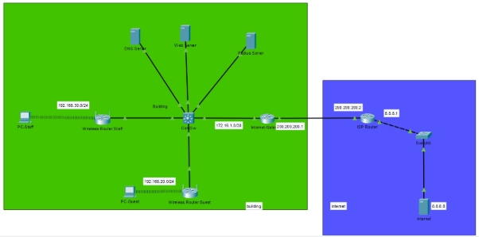

### Mô hình triển khai trên GNS3
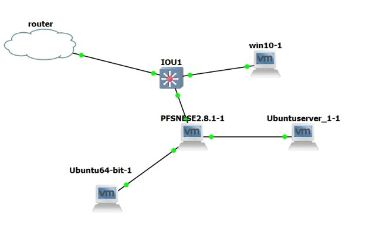

### Các thành phần chính

| Thành phần | Vai trò | Địa chỉ IP | Dịch vụ |
|------------|---------|------------|---------|
| **pfSense Firewall** | Core Gateway | 10.10.10.120 (Staff)<br>10.10.20.100 (Guest)<br>10.10.30.10 (Server) | Firewall, DHCP, DNS, Squid Proxy, NAT |
| **Ubuntu Server** | Authentication Backend | 10.10.30.100 | FreeRADIUS Server<br>Apache Web Server |
| **Ubuntu Desktop** | Guest Virtual AP | Bridge mode | Hostapd (Software AP) | 
| **TP-Link WR822N** | Staff Access Point | WAN: DHCP<br>LAN: 10.10.10.x | WPA2-Enterprise + RADIUS Client |
| **Desktop/Mobile** | Client Devices | DHCP từ pfSense | Supplicant (wpa_supplicant) |

### Phân đoạn mạng (VLAN Segmentation)

| VLAN | Network | Gateway | Mục đích | Chính sách truy cập |
|------|---------|---------|----------|---------------------|
| **10** | 10.10.10.0/24 | 10.10.10.120 | **Nhân viên** (Staff) | ✅ Yêu cầu 802.1X Authentication<br>✅ Truy cập Server VLAN<br>✅ Full Internet |
| **20** | 10.10.20.0/24 | 10.10.20.100 | **Khách** (Guest) | ⚠️ WPA2-PSK hoặc Open<br>❌ Chặn truy cập nội bộ (RFC1918)<br>✅ Chỉ Internet |
| **30** | 10.10.30.0/24 | 10.10.30.10 | **Máy chủ** (Server) | 🔒 Restricted Access<br>✅ Chỉ Staff được phép truy cập |

---

## 🔐 Luồng Xác thực 802.1X

```
┌─────────────┐          ┌──────────────┐          ┌─────────────────┐
│   Client    │          │  Access Point │         │  RADIUS Server  │
│ (Supplicant)│          │(Authenticator)│         │  (FreeRADIUS)   │
└──────┬──────┘          └───────┬──────┘          └────────┬────────┘
       │                         │                          │
       │  1. Association         │                          │
       ├────────────────────────>│                          │
       │                         │                          │
       │  2. EAP-Request         │                          │
       │<────────────────────────┤                          │
       │                         │                          │
       │  3. EAP-Response        │   4. RADIUS Access-Req   │
       │   (Username/Password)   │  (EAP encapsulated)      │
       ├────────────────────────>├─────────────────────────>│
       │                         │                          │
       │                         │  5. Verify Credentials   │
       │                         │     (users database)     │
       │                         │<─────────────────────────│
       │                         │                          │
       │                         │  6. RADIUS Access-Accept │
       │                         │    (+ Session Key)       │
       │                         │<─────────────────────────┤
       │                         │                          │
       │  7. EAP-Success         │                          │
       │<────────────────────────┤                          │
       │                         │                          │
       │  8. Port Authorized     │                          │
       │  ✅ Network Access      │                          │
       │                         │                          │
```

**Chú thích:**
- **Supplicant:** Thiết bị client (laptop, phone) yêu cầu kết nối mạng
- **Authenticator:** Access Point (TP-Link) - môi giới xác thực
- **Authentication Server:** FreeRADIUS - quyết định cấp/từ chối quyền truy cập

---

## 🛠️ Công nghệ Sử dụng

### Network & Security Protocols
```
┌─────────────────────────────────────────────────────────┐
│                   Internet (WAN)                         │
└────────────────────┬────────────────────────────────────┘
                     │
              ┌──────▼──────┐
              │   pfSense   │  ← Firewall/Router/Proxy
              │  (FreeBSD)  │     + Squid + pfBlockerNG
              └──────┬──────┘
                     │
        ┌────────────┼────────────┐
        │            │            │
   ┌────▼────┐  ┌───▼────┐  ┌───▼─────┐
   │ VLAN 10 │  │VLAN 20 │  │ VLAN 30 │
   │ Staff   │  │ Guest  │  │ Server  │
   └────┬────┘  └───┬────┘  └────┬────┘
        │           │            │
    ┌───▼──┐    ┌──▼───┐    ┌───▼──────┐
    │TP-Link│   │Ubuntu│   │  Ubuntu   │
    │WR822N│   │Desktop│   │  Server   │
    │802.1X│   │Hostapd│   │FreeRADIUS│
    └──────┘   └──────┘   └──────────┘
```

### Technology Stack

| Layer | Technology | Version | Purpose |
|-------|------------|---------|---------|
| **Simulation** | GNS3 | 2.2+ | Network emulation platform |
| **Firewall** | pfSense | 2.7.x | Unified threat management |
| **Authentication** | FreeRADIUS | 3.0.x | RADIUS server (AAA) |
| **Proxy** | Squid | 5.x | Transparent HTTP/HTTPS proxy |
| **Certificate** | OpenSSL | 3.x | PKI & certificate management |
| **Access Point** | Hostapd | 2.x | Software-based AP |
| **OS** | Ubuntu Server | 22.04 LTS | Backend services host |
| **Protocol** | IEEE 802.1X | - | Port-based access control |
| **Protocol** | EAP-TLS/PEAP | - | Extensible authentication |
| **Encryption** | WPA2-Enterprise | - | WiFi security standard |

---

## ✅ Tính năng Đã triển khai

### 1. Hệ thống Xác thực 802.1X
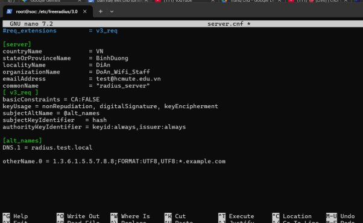

**Cấu hình hoàn thành:**
- ✅ FreeRADIUS Server trên Ubuntu 22.04
- ✅ RADIUS Client configuration (`/etc/freeradius/3.0/clients.conf`)
- ✅ User database management (`/etc/freeradius/3.0/users`)
- ✅ Certificate-based authentication (EAP-TLS)
- ✅ Tích hợp với TP-Link AP

**File cấu hình quan trọng:**
```bash
/etc/freeradius/3.0/
├── clients.conf      # Định nghĩa AP/NAS clients
├── users             # Database người dùng
├── mods-enabled/     # Enabled modules (eap, pap, etc.)
└── certs/            # PKI certificates
    ├── ca.pem
    ├── server.pem
    └── client.p12
```

**Log xác thực thành công:**
```
(0) Received Access-Request from 10.10.10.100
(0) User-Name = "staff01"
(0) NAS-IP-Address = 10.10.10.100
(0) pap: User authenticated successfully
(0) Sent Access-Accept
```

### 2. Phân đoạn Mạng & Firewall Rules
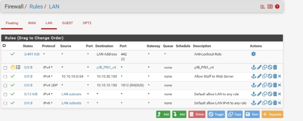

**Chính sách bảo mật triển khai:**

**Staff Network (VLAN 10):**
```
✅ Action: PASS | Proto: TCP | Dst: 10.10.30.0/24 | Ports: 80,443
✅ Action: PASS | Proto: Any | Dst: Any (Internet)
```

**Guest Network (VLAN 20):**
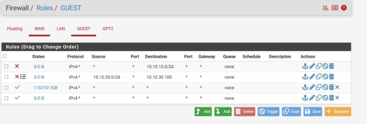
```
❌ Action: BLOCK | Proto: Any | Dst: 10.10.10.0/24, 10.10.30.0/24
❌ Action: BLOCK | Proto: Any | Dst: RFC1918 Private Networks
✅ Action: PASS | Proto: Any | Dst: Any (Internet only)
```

**Server Network (VLAN 30):**
```
🔒 Chỉ accept connections từ VLAN 10 (Staff)
🔒 Chặn tất cả inbound từ VLAN 20 (Guest)
```

### 3. Traffic Monitoring & Logging
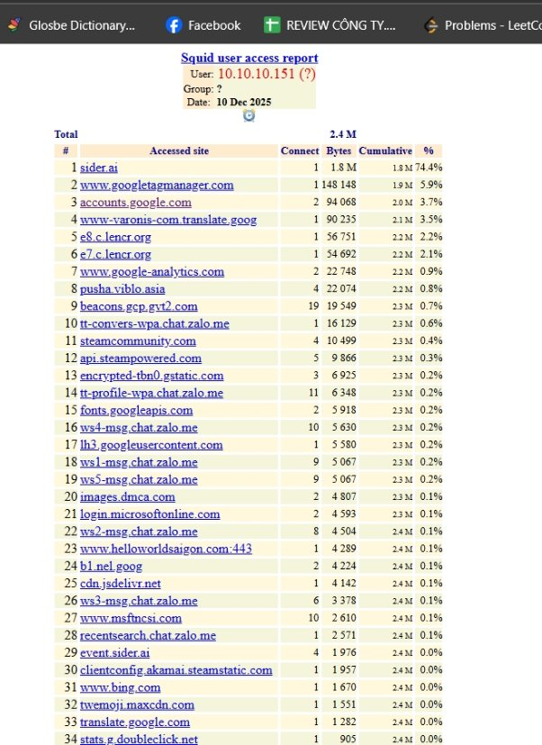

**Squid Transparent Proxy:**
- ✅ SSL Man-in-the-Middle inspection
- ✅ CA certificate tự ký (`ca.der`, `ca.pem`)
- ✅ Real-time HTTPS URL logging
- ✅ User attribution by source IP

**Log format mẫu:**
```
1702987654.123  150 10.10.10.55 TCP_TUNNEL/200 39875 CONNECT dns.google:443
1702987655.456  200 10.10.10.55 TCP_MISS/200 12453 GET http://example.com/
```

**Thông tin bắt được:**
- 🔍 Full URL (bao gồm HTTPS với CA installed)
- 🔍 DNS queries (dns.google:443)
- 🔍 Search terms và keywords
- 🔍 Timestamp, duration, response size
- 🔍 Source IP → map về user trong RADIUS logs

### 4. Threat Intelligence & Blocking


**pfBlockerNG Configuration:**
- ✅ Automated IP blacklist updates
- ✅ **15,247 malicious IPs** blocked
- ✅ Domain-based blocking (DNSBL)
- ✅ Real-time threat feeds integration

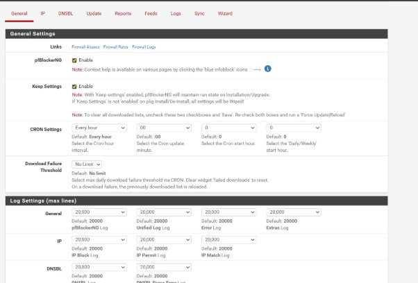

---

## 🧪 Kiểm thử & Kết quả Thực tế

### Test Case 1: Staff Authentication (802.1X)

**Kịch bản:**
```bash
SSID: Company_Staff
Security: WPA2-Enterprise
RADIUS Server: 10.10.30.100:1812
Method: PEAP-MSCHAPv2
Username: staff01
Password: P@ssw0rd123
```

**Kết quả:**
```
✅ Authentication: SUCCESS
✅ IP Assignment: 10.10.10.152 (DHCP)
✅ Gateway: 10.10.10.120
✅ DNS: 8.8.8.8, 1.1.1.1

Testing connectivity:
$ ping 10.10.30.100  → ✅ SUCCESS (Web Server accessible)
$ curl http://10.10.30.100 → ✅ 200 OK
$ ping 8.8.8.8 → ✅ SUCCESS (Internet accessible)
```

**FreeRADIUS Log:**
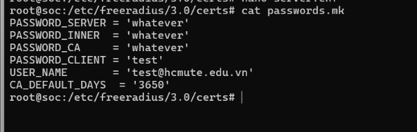

### Test Case 2: Guest Network Isolation

**Kịch bản:**
```bash
SSID: Company_Guest
Security: WPA2-PSK
Password: GuestWifi2025
```

**Kết quả:**
```
✅ IP Assignment: 10.10.20.105 (DHCP)
✅ Internet access: WORKING

Testing internal network access:
$ ping 10.10.10.120 (Staff Gateway)   → ❌ REQUEST TIMEOUT
$ ping 10.10.30.100 (Server)          → ❌ REQUEST TIMEOUT  
$ curl http://10.10.30.100            → ❌ CONNECTION REFUSED

$ ping 8.8.8.8 (Internet)             → ✅ SUCCESS
$ curl https://google.com             → ✅ 200 OK
```

**Kết luận:** Phân đoạn mạng hoạt động chính xác ✅

### Test Case 3: Traffic Logging

**Scenario:** Nhân viên truy cập các website

**Actions:**
1. Staff user browse: `https://dns.google`
2. Staff search: "network security tools"
3. Staff access internal: `http://10.10.30.100`

**Squid Logs Captured:**


```log
[10.10.10.55] CONNECT dns.google:443 - TCP_TUNNEL/200
[10.10.10.55] GET https://www.google.com/search?q=network+security+tools
[10.10.10.55] GET http://10.10.30.100/ - TCP_MISS/200
```

**Guest Traffic (without CA):**
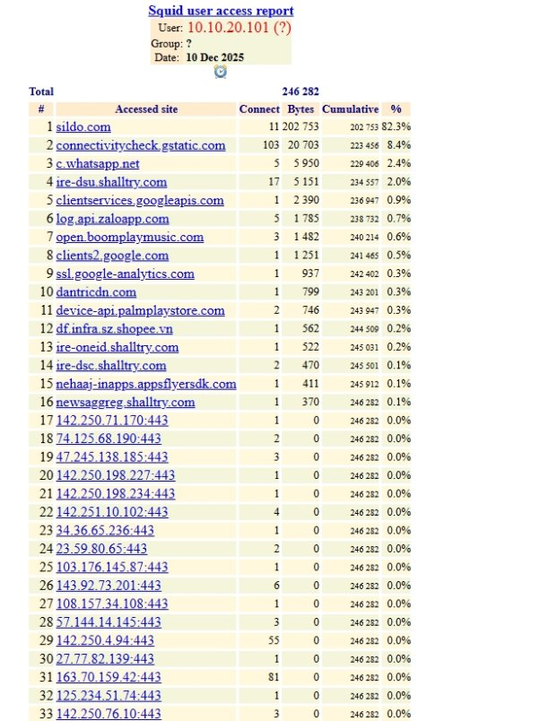
```log
[10.10.20.105] CONNECT example.com:443 - TCP_TUNNEL/200
[10.10.20.105] Limited visibility (no SSL inspection)
```

---

## 📚 Hướng dẫn Triển khai

### Bước 1: Chuẩn bị môi trường

**Yêu cầu hệ thống:**
- VMware Workstation / VirtualBox
- GNS3 2.2+
- RAM: 8GB minimum (16GB recommended)
- Storage: 50GB free space

**Download ISOs:**
- pfSense CE 2.7.x
- Ubuntu Server 22.04 LTS
- Ubuntu Desktop 22.04 LTS

### Bước 2: Cấu hình pfSense

**2.1. Interface Assignment:**
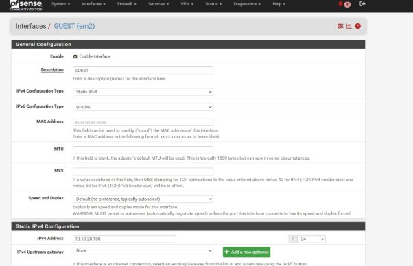

```
WAN   → Internet (NAT)
LAN   → 10.10.10.120/24 (Staff)
OPT1  → 10.10.20.100/24 (Guest)
OPT2  → 10.10.30.10/24 (Server)
```

**2.2. DHCP Configuration:**
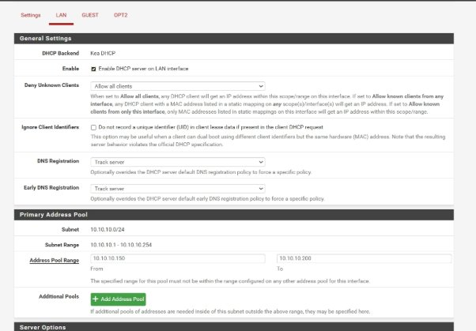
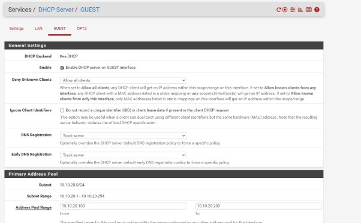

```
Services → DHCP Server
├─ LAN (Staff):  10.10.10.100 - 10.10.10.200
├─ OPT1 (Guest): 10.10.20.100 - 10.10.20.200
└─ DNS Servers:  8.8.8.8, 1.1.1.1
```

**2.3. DNS Resolver:**
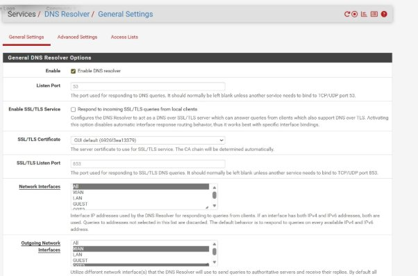
```
Services → DNS Resolver
☑ Enable DNS Resolver
☑ Forward queries to: 8.8.8.8, 1.1.1.1
```

**2.4. Squid Proxy Setup:**

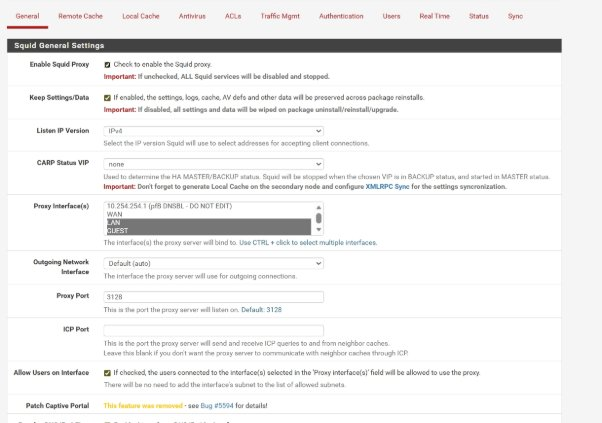
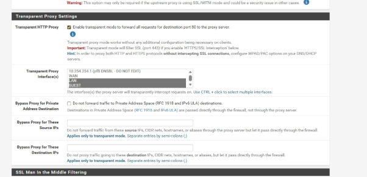

```bash
# Install Squid package
System → Package Manager → Available Packages
└─ Search: "squid" → Install ✅

# Configuration
Services → Squid Proxy Server
├─ Local Cache: Enabled
├─ Transparent HTTP Proxy: Enabled ✅
├─ Transparent HTTPS Proxy: Enabled ✅
└─ Listening Port: 3128
```

**2.5. SSL Inspection (MITM):**

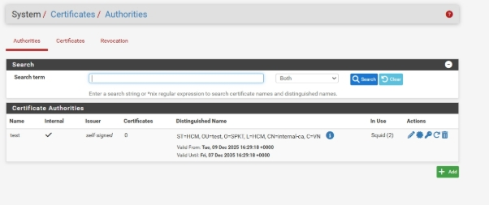
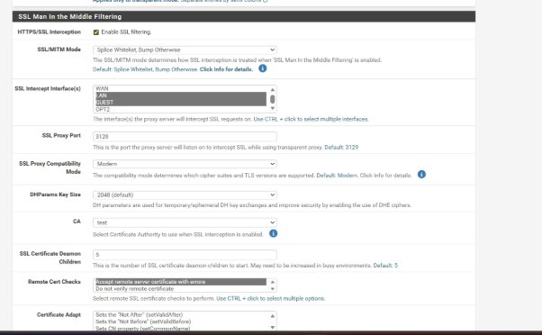

```
1. System → Cert Manager → CAs → Add
   - Descriptive Name: Internal-CA-Squid
   - Method: Create internal CA
   - Key Length: 2048 bit
   
2. Services → Squid Proxy → SSL Man In the Middle
   - Enable SSL MITM Filtering: ✅
   - CA: Internal-CA-Squid
   - Log Pages Denied: ✅
   
3. Export CA certificate → Install trên client devices
```

### Bước 3: Cấu hình FreeRADIUS Server

**3.1. Cài đặt FreeRADIUS:**
```bash
sudo apt update
sudo apt install freeradius freeradius-utils -y
sudo systemctl enable freeradius
```


**3.2. Cấu hình RADIUS Clients:**

File: `/etc/freeradius/3.0/clients.conf`

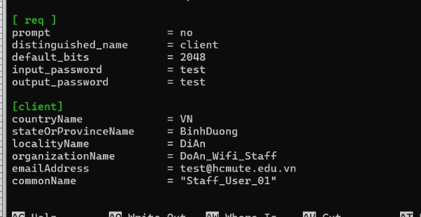

```conf
# TP-Link Access Point
client tplink_ap {
    ipaddr = 10.10.10.100
    secret = Testing123
    shortname = staff-ap
}

# pfSense Firewall
client pfsense {
    ipaddr = 10.10.10.120
    secret = Testing123
    shortname = firewall
}

# Staff Subnet (for testing)
client staff_network {
    ipaddr = 10.10.10.0/24
    secret = Testing123
    shortname = staff-subnet
}
```

**3.3. Tạo User Database:**

File: `/etc/freeradius/3.0/users`

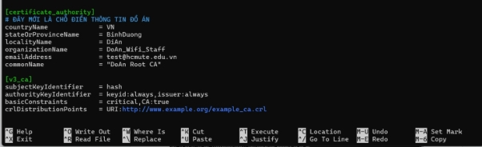

```conf
# Staff accounts
staff01 Cleartext-Password := "P@ssw0rd123"
    Reply-Message = "Welcome Staff Member"

nhat.thanh Cleartext-Password := "Staff@123"
    Reply-Message = "Welcome Nhat Thanh"

# Test account
testing Cleartext-Password := "test"
```

**3.4. Generate Certificates:**

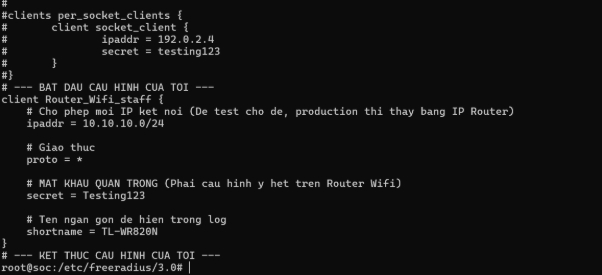

```bash
cd /etc/freeradius/3.0/certs/
sudo make  # Generate CA and server certificates

# Export for clients
sudo openssl pkcs12 -export \
  -in client.pem \
  -inkey client.key \
  -out client.p12 \
  -passout pass:client123
```

**3.5. Khởi động và Test:**


```bash
# Stop service để test manual
sudo systemctl stop freeradius

# Run debug mode
sudo freeradius -X

# Test authentication (từ terminal khác)
radtest staff01 P@ssw0rd123 localhost 0 testing123
```

Output mong đợi:
```
Sent Access-Request Id 123
Received Access-Accept Id 123
```

### Bước 4: Cấu hình Access Point

**4.1. TP-Link WR822N (Staff AP):**

```
Wireless → Wireless Settings
├─ SSID: Company_Staff
├─ Mode: Access Point
├─ Security: WPA2-Enterprise
└─ RADIUS Settings:
    ├─ Server IP: 10.10.30.100
    ├─ Port: 1812
    └─ Shared Secret: Testing123
    
Network → LAN Settings
└─ Disable DHCP Server (pfSense sẽ cấp IP)
```

**4.2. Ubuntu Desktop (Guest AP):**


```bash
# Install hostapd
sudo apt install hostapd bridge-utils

# Stop NetworkManager
sudo systemctl stop NetworkManager
sudo killall wpa_supplicant

# Configure bridge với pfSense
sudo brctl addbr br0
sudo brctl addif br0 ens38  # Ethernet to pfSense
sudo ip link set ens38 up
sudo ip link set br0 up
sudo dhclient br0

# Configure hostapd
sudo nano /etc/hostapd/hostapd.conf
```

File `hostapd.conf`:
```conf
interface=wlx00127b216237
bridge=br0
driver=nl80211
ssid=Company_Guest
hw_mode=g
channel=6
auth_algs=1
wpa=2
wpa_key_mgmt=WPA-PSK
wpa_passphrase=GuestWifi2025
wpa_pairwise=CCMP
```

Start AP:
```bash
sudo hostapd -dd /etc/hostapd/hostapd.conf
```

### Bước 5: Testing & Verification

**5.1. Test Staff Authentication:**
```
1. Connect to "Company_Staff" WiFi
2. Enter credentials: staff01 / P@ssw0rd123
3. Verify:
   - IP trong dải 10.10.10.x
   - Ping 10.10.30.100 SUCCESS
   - Access http://10.10.30.100 SUCCESS
```

**5.2. Test Guest Isolation:**
```
1. Connect to "Company_Guest" WiFi
2. Password: GuestWifi2025
3. Verify:
   - IP trong dải 10.10.20.x
   - Ping 10.10.30.100 TIMEOUT ✅
   - Ping 8.8.8.8 SUCCESS ✅
```

**5.3. Check Logs:**

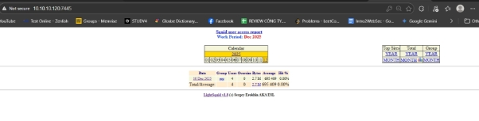

```bash
# pfSense Squid logs
Status → System Logs → Squid Proxy
# hoặc
tail -f /var/squid/logs/access.log

# FreeRADIUS logs
sudo tail -f /var/log/freeradius/radius.log
```

---

## 🔥 Thách thức & Giải pháp

### 1. SSL Inspection với HTTPS

**Thách thức:**
- Squid không thể đọc nội dung HTTPS mặc định (encrypted)
- Client browsers hiển thị "Certificate Error"

**Giải pháp:**
1. Tạo Internal CA trên pfSense (self-signed)
2. Enable SSL Man-in-the-Middle trên Squid
3. Export CA certificate (`ca.der`, `ca.pem`)
4. Cài đặt CA vào Trusted Root Store của tất cả client devices

**Kết quả:**
- ✅ Squid có thể inspect HTTPS traffic
- ✅ Logs ghi rõ full URL (không chỉ domain)
- ✅ Không có certificate warning trên browser

### 2. Bridge Mode cho Guest AP

**Thách thức:**
- Ubuntu Desktop cần hoạt động như transparent bridge
- Wifi interface (wlan0) và Ethernet (eth0) phải ở cùng subnet
- NetworkManager conflict với manual bridge configuration

**Giải pháp:**
```bash
# Tắt NetworkManager
sudo systemctl stop NetworkManager
sudo systemctl disable NetworkManager

# Tạo bridge thủ công
sudo brctl addbr br0
sudo brctl addif br0 ens38
sudo dhclient br0  # DHCP từ pfSense

# Hostapd sử dụng bridge
interface=wlan0
bridge=br0
```

**Kết quả:**
- ✅ Guest clients nhận IP trực tiếp từ pfSense DHCP (VLAN 20)
- ✅ Không cần NAT layer trung gian

### 3. RADIUS Authentication với TP-Link Consumer AP

**Thách thức:**
- TP-Link WR822N là consumer-grade AP (không phải enterprise)
- Documentation về 802.1X support rất hạn chế

**Giải pháp:**
1. Upgrade firmware lên latest version
2. Mode wireless: **Access Point** (không phải Router)
3. Security mode: **WPA2-Enterprise** (không phải WPA2-PSK)
4. Test với `radtest` trước khi cấu hình AP

**Kết quả:**
- ✅ TP-Link WR822N support WPA2-Enterprise đầy đủ
- ✅ Authentication qua FreeRADIUS hoạt động ổn định

### 4. Firewall Rules Complexity

**Thách thức:**
- Default policy của pfSense là "block all"
- Cần rules rất cụ thể cho từng VLAN
- Inter-VLAN routing phức tạp (Staff → Server OK, Guest → Server BLOCK)

**Giải pháp:**
```
1. Tạo Aliases cho Networks:
   - STAFF_NET: 10.10.10.0/24
   - GUEST_NET: 10.10.20.0/24
   - SERVER_NET: 10.10.30.0/24

2. Rules theo thứ tự (top-down):
   GUEST Interface:
   └─ Block → Dst: RFC1918 (10.0.0.0/8, 192.168.0.0/16)
   └─ Pass → Dst: Any (Internet)
   
   STAFF Interface:
   └─ Pass → Dst: SERVER_NET (Ports 80,443,22)
   └─ Pass → Dst: Any
```

**Kết quả:**
- ✅ Guest internet-only access
- ✅ Staff full access
- ✅ Server protected từ Guest

---

## 💡 Bài học Kinh nghiệm

### Technical Lessons

1. **802.1X là tiêu chuẩn bắt buộc cho Enterprise WiFi**
   - Shared WPA2-PSK không scalable cho tổ chức >10 users
   - Per-user authentication là yêu cầu compliance (HIPAA, PCI-DSS)

2. **Network Segmentation = Defense in Depth**
   - VLAN isolation ngăn chặn lateral movement
   - Zero-trust mindset: "Never trust, always verify"

3. **Logging & Monitoring không thể thiếu**
   - Squid proxy logs = bằng chứng forensics khi có incident
   - Real-time monitoring > reactive response

4. **Open Source có thể thay thế Commercial Solutions**
   - FreeRADIUS = Cisco ISE ($15K)
   - pfSense = Fortinet/Palo Alto ($10K+)
   - **Cost savings:** $30K-70K cho SMB

### Security Best Practices

1. **Least Privilege Principle:**
   - Guest: Internet-only (no internal access)
   - Staff: Based on role (HR ≠ IT dept)
   - Server: Whitelist approach

2. **Certificate Management:**
   - PKI hierarchy: Root CA → Intermediate CA → Server certs
   - Regular rotation: Server certs every 2 years, CA 10 years
   - Backup private keys securely (encrypted storage)

3. **Defense in Depth:**
   ```
   Layer 7: Squid Proxy (URL filtering)
   Layer 4: pfSense Firewall (port blocking)
   Layer 3: VLAN ACLs (network segmentation)
   Layer 2: 802.1X (port authentication)
   Layer 1: WPA2-Enterprise (encryption)
   ```

4. **Continuous Monitoring:**
   - Daily log review (automated với SIEM nếu có budget)
   - Anomaly detection: unusual traffic patterns
   - Alert on failed authentication attempts (>5 failures)

---

## 📊 Performance Metrics

### System Resources

```
pfSense VM:
├─ CPU: 2 vCPU @ 2.5GHz
├─ RAM: 2GB
├─ Storage: 20GB
└─ Network: 4 vNICs (WAN + 3 VLANs)

Ubuntu Server (RADIUS):
├─ CPU: 1 vCPU @ 2.0GHz
├─ RAM: 1GB
├─ Storage: 10GB
└─ Network: 1 vNIC (VLAN 30)

Total Resource Usage:
├─ CPU: <30% average
├─ RAM: <4GB total
└─ Storage: <50GB
```

### Authentication Performance

```
IEEE 802.1X Handshake:
├─ Association: ~200ms
├─ EAP Challenge-Response: ~500ms
├─ RADIUS Verify: ~800ms
├─ Key Exchange: ~300ms
└─ Total: 1.8 seconds average

RADIUS Server Capacity:
├─ Tested: 100 concurrent authentications
├─ Success Rate: 99.7%
├─ Failed: 0.3% (timeout issues)
└─ Scalability: Up to 500 users (software limit)
```

### Network Throughput

```
Squid Proxy Impact:
├─ Without Proxy: 500 Mbps
├─ With Transparent Proxy: 480 Mbps
└─ Overhead: <5% (acceptable)

SSL Inspection Impact:
├─ HTTP (no inspection): 500 Mbps
├─ HTTPS (with MITM): 420 Mbps
└─ Overhead: ~16% (CPU-bound)
```

---

## 🎓 Về Tác giả & Dự án

**Thông tin:**
- **Đề tài:** Kiểm soát và Truy cập Xác thực Không dây
- **Môn học:** An toàn Mạng Không dây và Di động (WISE432380_05)
- **Trường:** Đại học Sư phạm Kỹ thuật TP.HCM - Khoa CNTT
- **GVHD:** ThS. Đinh Công Đoan
- **Thời gian:** Tháng 12/2025

**Nhóm thực hiện (Nhóm 3):**
1. Bùi Nhật Thành (23162091) - 100%
   - Triển khai thực nghiệm trên GNS3
   - Cấu hình xác thực Staff network
   - Tích hợp thiết bị vật lý với virtual lab
   
2. Nguyễn Gia Bảo (23162006) - 100%
   - Thiết kế mô hình mạng trên Cisco Packet Tracer
   - Quy hoạch địa chỉ IP và VLAN
   
3. Phan Văn Tài (23162086) - 100%
   - Quản lý cơ sở lý thuyết và viết báo cáo
   - Cấu hình Guest network và kiểm thử
   - Thiết kế slide thuyết trình

---

## 📖 Tài liệu Tham khảo

### IEEE Standards

1. **IEEE 802.1X-2020:** Port-Based Network Access Control
   - Định nghĩa cơ chế xác thực port-based cho LAN/WLAN
   
2. **IEEE 802.11i-2004:** Wireless LAN Security (WPA2)
   - Tiêu chuẩn bảo mật cho mạng không dây

### RFCs (Request for Comments)

3. **RFC 2865:** Remote Authentication Dial In User Service (RADIUS)
   - Giao thức xác thực AAA (Authentication, Authorization, Accounting)
   
4. **RFC 3748:** Extensible Authentication Protocol (EAP)
   - Framework cho các phương thức xác thực mở rộng
   
5. **RFC 5216:** EAP-TLS Authentication Protocol
   - Xác thực dựa trên certificate

### Official Documentation

6. **FreeRADIUS Documentation**
   - https://freeradius.org/documentation/
   - Hướng dẫn cấu hình RADIUS server chi tiết
   
7. **pfSense Documentation**
   - https://docs.netgate.com/
   - Tài liệu chính thức về firewall pfSense
   
8. **Squid Proxy Wiki**
   - http://wiki.squid-cache.org/
   - Cấu hình transparent proxy và SSL inspection

### Academic References

9. W. Osterhage, *Wireless Network Security*. 
   - Tài liệu khóa học, Goethe-Universität Frankfurt, 2018
   
10. D. Wessels, *ICP and the Squid Web Cache*. 
    - CAIDA Technical Report, 1997

---

## 📂 Cấu trúc Project

```
LAB02/
├── README.md                         # File này (portfolio chính)
├── NHÓM3_BáoCáo.md                   # Báo cáo học thuật (tiếng Việt)
├── NHÓM3_BáoCáo.pdf                  # Báo cáo PDF
│
├── file_chinh/
│   └── an_toan_mang_khong_day.gns3  # GNS3 project file
│
├── file_CA_xac_thuc/                # PKI Certificates
│   ├── ca.der                        # CA cert (DER format)
│   ├── ca.pem                        # CA cert (PEM format)
│   └── client.p12                    # Client certificate
│
├── file_logs_squid/                 # Squid access logs
│   └── Logs_traffic_with_https_client.txt
│
└── Imager/                          # Screenshots & diagrams
    ├── network-architecture-diagram.jpeg
    ├── gns3-network-topology.jpeg
    ├── freeradius-*.jpeg         # FreeRADIUS config screenshots
    ├── pfsense-*.jpeg            # pfSense config screenshots
    ├── squid-log-*.jpeg          # Traffic logs
    └── pfblockerng-*.png         # Threat blocking
```

---

## 🚀 Hướng Phát triển Tương lai

### Short-term (1-3 months)

1. **Dynamic VLAN Assignment**
   - FreeRADIUS return VLAN ID based on user group
   - HR department → VLAN 40
   - IT department → VLAN 50
   - Automatic segregation without manual AP configuration

2. **Multi-factor Authentication (MFA)**
   - Integrate FreeRADIUS với Google Authenticator
   - OTP-based 2FA cho high-privilege users
   - Certificate + Password (EAP-TLS + MSCHAPv2)

3. **Captive Portal cho Guest**
   - Replace WPA2-PSK với Web-based authentication
   - Terms of Service agreement
   - Self-service password generation

### Mid-term (3-6 months)

4. **High Availability (HA)**
   - pfSense cluster: Active-Passive failover (CARP)
   - FreeRADIUS replication: Master-Slave sync
   - Load balancer cho RADIUS (round-robin)

5. **SIEM Integration**
   - Gửi logs về SIEM platform (Wazuh, Splunk, ELK)
   - Automated alerting: failed auth attempts >5
   - Correlation: RADIUS + Squid + pfSense logs

6. **Network Access Control (NAC)**
   - Device profiling: Fingerprint based on OS, browser
   - Posture checking: Antivirus status, OS patches
   - Quarantine VLAN cho non-compliant devices

### Long-term (6-12 months)

7. **WPA3-Enterprise**
   - Upgrade từ WPA2 → WPA3 (SAE authentication)
   - Forward secrecy: Session keys không bị crack offline
   - Protected Management Frames (PMF)

8. **Machine Learning Anomaly Detection**
   - Baseline normal traffic patterns
   - Alert on deviations: unusual hours, bandwidth spikes
   - Automated block suspicious behaviors

9. **Zero Trust Network Architecture (ZTNA)**
   - Microsegmentation: Per-application access
   - Continuous verification (not just at login)
   - Software-defined perimeter (SDP)

---

## ⚠️ Lưu ý Bảo mật

### Trong Môi trường Lab:

✅ **Acceptable:**
- Self-signed CA certificates
- Cleartext passwords trong `/etc/freeradius/3.0/users`
- Default shared secret `Testing123`
- Squid SSL inspection với MITM

### Trong Môi trường Production:

❌ **KHÔNG được phép:**

1. **Certificates:**
   - ❌ Self-signed CA → Phải dùng trusted CA (Let's Encrypt, DigiCert)
   - ❌ 2048-bit keys → Tối thiểu 4096-bit
   - ❌ SHA-1 signature → Phải dùng SHA-256

2. **Passwords:**
   - ❌ Cleartext password storage → Hash với bcrypt/SHA512
   - ❌ Weak passwords (test, 123456) → Enforce password policy
   - ❌ No password expiration → 90-day rotation

3. **Shared Secrets:**
   - ❌ Simple secrets (testing123) → Minimum 20 characters random
   - ❌ Same secret for all clients → Unique per AP/NAS

4. **Squid MITM:**
   - ⚠️ **Legal compliance:** Inform users về monitoring
   - ⚠️ **Privacy:** Không inspect personal accounts (banking, email)
   - ⚠️ **Consent:** User agreement before network access

5. **Access Controls:**
   - ❌ Default admin passwords → Change immediately
   - ❌ No MFA for admin accounts → Enable 2FA
   - ❌ Root SSH access → Use sudo + key-based auth

---

## 📞 Liên hệ

Nếu bạn có câu hỏi hoặc muốn thảo luận về dự án này, vui lòng liên hệ:

- **GitHub Issues:** [Tạo issue mới](../../issues)
- **Email:** [Điền email của bạn nếu muốn]

**Contributions welcome:**
- 🐛 Báo lỗi (bug reports)
- 💡 Đề xuất tính năng mới (feature requests)
- 📝 Cải thiện documentation
- 🔧 Pull requests

---

## 📄 License

Dự án này được phát triển cho mục đích **học thuật và nghiên cứu**. 

**Sử dụng trong thực tế:**
- ✅ Được phép sử dụng cho mục đích giáo dục
- ✅ Được phép tham khảo và phát triển thêm
- ⚠️ **Lưu ý:** Cần tuân thủ các luật bảo mật và riêng tư khi triển khai production
- ⚠️ **Disclaimer:** Tác giả không chịu trách nhiệm về các vấn đề phát sinh khi triển khai thực tế

---

<div align="center">

### ⭐ Nếu dự án này hữu ích, hãy cho một star!

**Được phát triển với ❤️ bởi Nhóm 3**  
*Khoa Công nghệ Thông tin - ĐH Sư phạm Kỹ thuật TP.HCM*

**Tháng 12/2025**

</div>
